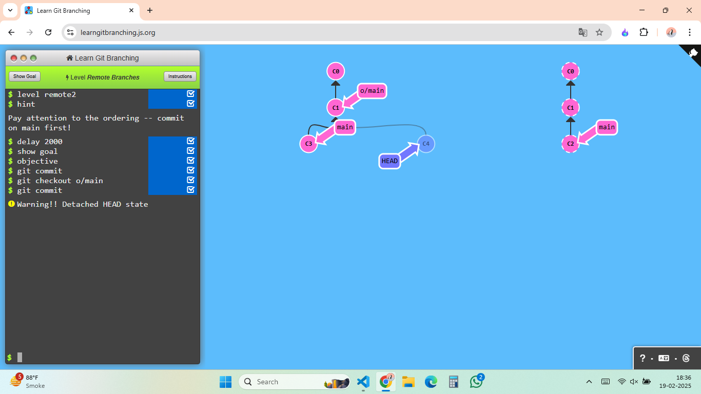

## Level -1: Git remotes

```bash
git clone
```

The below is the ahieved result with this command


## Level-2

```bash
git commit
git checkout o/main
git commit
```



## Level -3: Git remote branches

```bash
git fetch
```

The below is the ahieved result with this command


## Level -4: Git remote branches

```bash
 git pull
```

The below is the ahieved result with this command


## Level -5: Git remote branches

```bash
git fakeTeamwork main 1
git branch -f main c1
git commit
git fetch
git merge o/main
```

The below is the ahieved result with this command


## Level -6: Git remote branches

```bash
git fakeTeamwork main 1
git branch -f main c1
git commit
git fetch
git merge o/main
```

The below is the ahieved result with this command


## Level -7: Git remote branches

```bash
git fakeTeamwork main 1
git fetch
git commit
git rebase o/main
git push
```

The below is the ahieved result with this command


## Level -8: Git remote branches

```bash
git branch feature
git checkout feature
git push
```

The below is the ahieved result with this command


