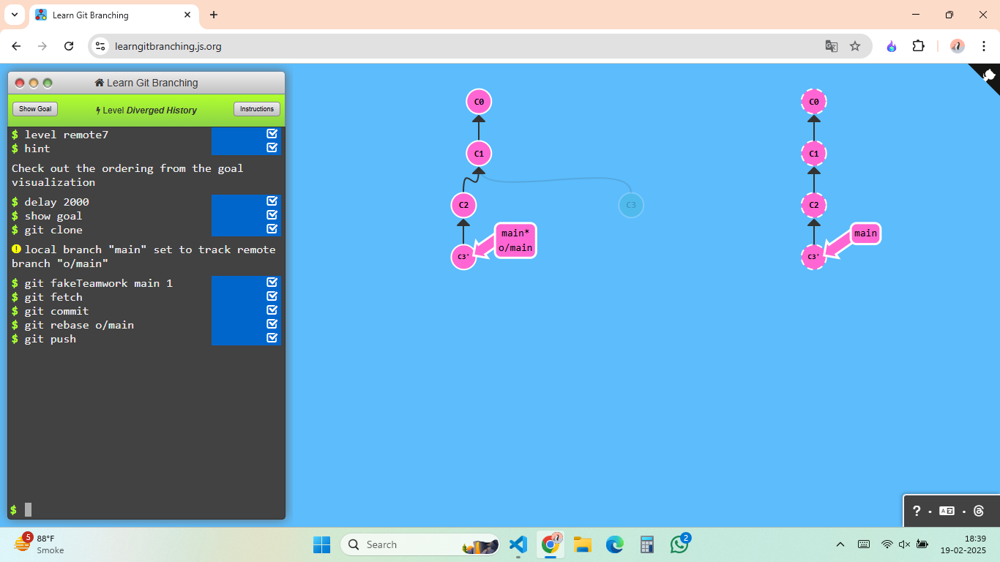
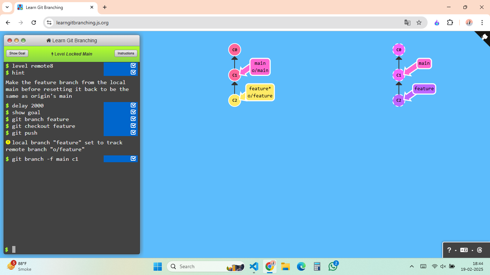
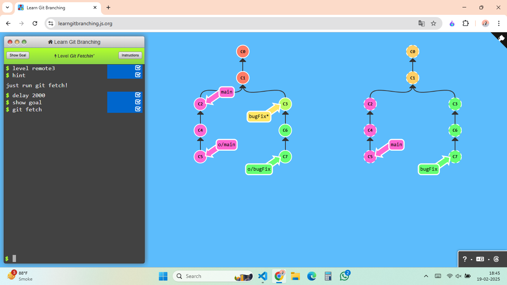

## Level -1

```bash
git checkout main
git pull --rebase
git checkout side1
git rebase main
git checkout side2
git rebase side1
git checkout side3
git rebase side2
git checkout main
git rebase side3
```

The below is the ahieved result with this command


## Level -2

```bash
git checkout main
git pull
git merge side1
git merge side2
git merge side3
git push
```

The below is the ahieved result with this command


## Level -3

```bash
git checkout -b side
git branch -u o/main side #local branch "side" set to track remote branch "o/main"
git fetch
git commit
git rebase c2
git push
```

The below is the ahieved result with this command


## Level -4

```bash
git push origin main
git push origin foo
```

The below is the ahieved result with this command


## Level -5

```bash
git push origin foo:main
git push origin main^:foo
```

The below is the ahieved result with this command



## Level -6

```bash
git fetch origin c3:foo
git fetch origin c6:main
git checkout foo
git merge main
```

The below is the ahieved result with this command



## Level -7

```bash
git fetch origin :bar
git push origin :foo
```

The below is the ahieved result with this command



## Level -8

```bash
git pull origin c3:foo
git pull origin c2:side
```

The below is the ahieved result with this command


